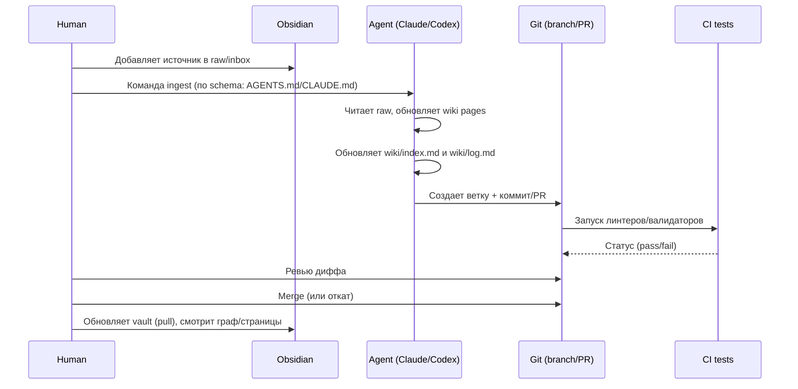

# Интеграция Obsidian-вольта с Claude Code и OpenAI Codex по паттерну Karpathy LLM Wiki

## Executive summary

Паттерн entity["people","Andrej Karpathy","ai researcher"] «LLM Wiki» предлагает относиться к базе знаний как к кодовой базе: **Obsidian — как IDE для чтения и навигации**, а агент (Claude Code / Codex) — как «программист», который **пишет и поддерживает** структуру вики. Ключевая идея: не «каждый раз заново доставать куски из raw», а **инкрементально компилировать raw-источники в устойчивую, взаимосвязанную вики**, которую затем легко опрашивать и обслуживать. citeturn24view1

Практическая реализация сводится к трем слоям и трем операциям:

- **Слои:** `raw/` (истина, неизменяемая), `wiki/` (LLM-владение), «схема» — файл инструкций для агента (например, `CLAUDE.md` или `AGENTS.md`). citeturn24view1  
- **Операции:** `ingest` (разбор нового raw и распределение знаний по вики), `query` (ответы с опорой на вики + ссылки), `lint` (проверка здоровья вики: противоречия, сироты, пробелы, устаревание). citeturn24view1turn24view0  
- **Навигационный «каркас» вики:** `index.md` (каталог страниц + краткое описание) и `log.md` (хронологическая лента того, что делали) — обновляются агентом. citeturn11view1turn24view1

Ниже — три архитектуры внедрения (от простого к промышленному), конкретные плагины/инструменты, пошаговая настройка, пример `AGENTS.md`, рабочие промпты/воркфлоу для Codex и Claude Code, CI/CD, тестирование, миграция существующего вольта и безопасный откат.

## Ключевые концепции

### Почему «компиляция» лучше «подклеивания контекста»

В «LLM Wiki» агент не ограничивается «проиндексировал и забыл». Он **читает новый источник, извлекает знания, встраивает их в существующую сеть страниц**, обновляет сущности и темы, фиксирует противоречия и усиливает синтез. Это создает накопительный эффект: однажды построенная вики дальше уточняется, а не пересобирается на каждый вопрос. citeturn11view0turn24view1

Карпатий явно описывает рабочую триаду: **Obsidian как IDE, LLM как программист, wiki как кодовая база**. citeturn24view1

### Три слоя в файловой системе

- **Raw sources (immutable):** статьи, PDF, транскрипты, изображения, данные. Агент **читает**, но **не изменяет** raw — это «source of truth». citeturn24view1  
- **Wiki (LLM-owned):** md-страницы (саммари, сущности, концепты, сравнительные таблицы, синтезы). Агент создает/обновляет, человек читает. citeturn24view1  
- **Schema:** файл инструкций, который дисциплинирует агента (в Karpathy-версии — `CLAUDE.md` для Claude Code или `AGENTS.md` для Codex). citeturn24view1

### Index + Log как «замена RAG-инфраструктуре» на персональном масштабе

`index.md` — «контентный каталог»: ссылки на страницы, one-liner, метаданные; агент читает его первым при запросах. citeturn11view1turn24view1  
`log.md` — «хронология действий»: ingest/query/lint; полезно делать записи парсируемыми (единый префикс дат). citeturn11view1turn24view1

### Lint как обязательная операция

Karpathy прямо выделяет «lint» как периодическую проверку здоровья: противоречия, устаревание, «сироты», пробелы, недостающие перекрестные ссылки, гипотезы для веб-поиска. citeturn24view0turn24view1  
Это важно для практичности: без «lint» любая агентная вики дрейфует и разрастается хаотично.

## Компоненты, плагины и prerequisites

### Минимальные prerequisites

- Desktop-установка Obsidian (чтобы использовать кластер плагинов и локальные интеграции; мобильные сценарии для Git-плагина могут быть нестабильны). citeturn10view3  
- Git (локально). Git нужен и как версия/откат, и как «пакетирование изменений» для PR-процесса. (Подход «Git checkpoints» рекомендуется и в материалах по Codex). citeturn21search26  
- Node.js (для установки Codex CLI и части MCP-инструментов). Codex CLI устанавливается через npm. citeturn8view3turn21search26  
- Python (если используете `mcp-obsidian`, который в типичной конфигурации запускается через `uv/uvx`). citeturn7view5

### Обязательные инструменты и плагины (точные названия)

Ниже — «ядро» под ваш кейс (включая ровно те элементы, которые вы запросили: Obsidian Local REST API, MCP servers, Obsidian Git, SDK).

| Компонент | Зачем нужен | Источник/документация |
|---|---|---|
| Obsidian community plugin **Local REST API** | Дает защищенный REST API к вольту: чтение/запись/patch по заголовкам, поиск, команды, теги; HTTPS + API key | GitHub repo плагина citeturn9view2turn7view6 |
| Obsidian community plugin **Obsidian Git** (Vinzent03/obsidian-git) | Версионирование/синхронизация: auto commit/pull/push, diff/history view; важен для откатов и PR-режима | README репозитория citeturn10view3turn10view1 |
| **mcp-obsidian** (MarkusPfundstein/mcp-obsidian) | MCP-сервер, который «переводит» запросы агента в вызовы Obsidian Local REST API | README репозитория citeturn7view5 |
| **Claude Code** (CLI) | Агентный терминальный инструмент: читает/редактирует файлы, запускает команды; поддерживает MCP и `CLAUDE.md` | Claude Code docs overview citeturn15view0turn8view5 |
| **OpenAI Codex CLI** | Агентный CLI: читает/меняет код/файлы и может запускать команды; поддерживает MCP и `AGENTS.md` | Codex CLI docs citeturn8view3turn8view0 |
| **Claude Agent SDK** (`@anthropic-ai/claude-agent-sdk`, `claude-agent-sdk`) | Для программной оркестрации агентов (в т.ч. без интерактива), если хотите «промышленный» пайплайн | Migration guide citeturn25view0 |
| **OpenAI Agents SDK** (`openai-agents`) | Для оркестрации/трейсинга; может запускать Codex CLI как MCP-сервер | Codex + Agents SDK guide citeturn7view9 |

### Инфраструктурные компоненты для автоматизации

- **GitHub code review / actions:** обе экосистемы умеют CI/PR-автоматизацию:  
  - Claude Code GitHub Actions: запуск и автоматизация через workflow, упоминания, PR/issue workflow. citeturn8view6  
  - Codex GitHub Action: `openai/codex-action@v1` + `codex exec` для CI. citeturn21search0turn21search2  
- **MCP** как стандарт подключения инструментов/данных к агентам — ключ к «аккуратному» доступу к вольту и внешним системам. citeturn14view0turn14view1

## Архитектурные варианты и сравнение

Ниже три архитектуры, которые соответствуют вашему запросу:  
1) **простой git + Codex CLI**, 2) **REST API + MCP**, 3) **оркестрация на базе Claude Code** (и/или SDK).

Перед таблицей — важное уточнение: Codex и Claude Code имеют собственные механизмы «проектных инструкций»: у Codex это `AGENTS.md` (читается перед любой работой), у Claude Code — `CLAUDE.md` (загружается в начале каждой сессии) и более широкая система `.claude/`. citeturn8view4turn15view2turn7view3

### Сравнительная таблица архитектур

| Архитектура | Кратко | Где выполняется работа | Главные плюсы | Главные минусы | Когда выбирать |
|---|---|---|---|---|---|
| git + CLI (локально) | Агент редактирует md прямо в репозитории (vault) + Git как контроль/откат | Локальная машина | Максимальная приватность, нулевой «middleware», быстрый старт, легко откатывать | Больше «ручной дисциплины», выше риск «агент переписал лишнее», слабее интеграция с «активной заметкой» в Obsidian | Персональный вольт, чувствительные данные, быстрый PoC citeturn21search26turn24view1 |
| REST API + MCP | Obsidian Local REST API + MCP-сервер для точечных операций (search/patch/open/active) | Локально (Obsidian должен быть запущен) | Точечные правки (PATCH по заголовкам), поиск через Obsidian, меньше «массовых перезаписей», удобнее работать с active note | Сложнее установка, нужны ключи/сертификат (self-signed), больше точек отказа | Когда хотите «безопасное редактирование» и интеграцию с UI Obsidian citeturn9view2turn7view5turn14view1 |
| Оркестрация Claude Code | Авто-ingest/lint/query по расписанию и событиям (в облаке или в CI) + PR-поток | Облако/CI или сервер | Автоматизация (nightly lint, триггеры), работа «в фоне», стандартизация для команды | Более высокий риск утечек/секретов, обязательно продуманная политика доступа; «preview»-поведение может меняться | Командный вольт/корпоративная база, нужда в расписании и интеграции с GitHub citeturn15view4turn8view6turn21search0 |

### Mermaid-диаграмма архитектуры

```mermaid
flowchart TB
  subgraph User[Пользователь]
    U1[Добавляет raw-источник\n(raw/inbox)]
    U2[Ставит задачу агенту\n(ingest/query/lint)]
    U3[Просматривает Obsidian\nграф/страницы]
  end

  subgraph Vault[Obsidian vault (Git repo)]
    R[raw/\nimmutable sources]
    W[wiki/\nLLM-owned pages]
    I[index.md]
    L[log.md]
    S[Schema:\nAGENTS.md + CLAUDE.md]
  end

  subgraph LocalAgents[Локальные агенты]
    CC[Claude Code CLI]
    CX[Codex CLI]
  end

  subgraph Tooling[Интеграционный слой]
    REST[Obsidian Local REST API\nHTTPS+API key]
    MCPo[mcp-obsidian\nMCP server]
  end

  subgraph Automation[Автоматизация]
    GH[GitHub PR/CI]
    CCI[Claude Code GitHub Actions]
    CXI[Codex GitHub Action]
    Routines[Claude Code routines\n(schedule/API/GitHub triggers)]
  end

  U1 --> R
  U2 --> CC
  U2 --> CX
  CC <--> Vault
  CX <--> Vault

  CC <-- MCP --> MCPo
  CX <-- MCP --> MCPo
  MCPo <--> REST
  REST <--> Vault

  Vault <--> GH
  GH --> CCI
  GH --> CXI
  GH --> Routines

  U3 --> Vault
```

## Практическая реализация

Ниже — «канонический» план внедрения: сначала локально (быстрый запуск), затем MCP (безопасные точечные операции), затем автоматизация (CI/оркестрация).

### Шаги подготовки структуры вольта

Рекомендованная структура (минимальная, но расширяемая):

```text
vault/
  raw/
    inbox/
    assets/
  wiki/
    entities/
    concepts/
    sources/
    syntheses/
    index.md
    log.md
  AGENTS.md
  CLAUDE.md
  .codex/
    config.toml
  .claude/
    settings.json
    settings.local.json   # gitignored (секреты)
    rules/
  .mcp.json               # MCP servers для Claude Code (project)
  scripts/
    validate_wiki.py
  .gitignore
```

Почему так:

- `raw/` должен оставаться **immutable**. Это прямо заложено в паттерне. citeturn24view1  
- `wiki/` — слой, которым владеет агент, и где он может спокойно обновлять десятки файлов за одну ingest-операцию. citeturn24view1  
- `index.md` и `log.md` — обязательные «скелетные» файлы: индекс для ориентирования/поиска, лог для истории ingest/query/lint. citeturn11view1turn24view1

### Настройка Obsidian под LLM Wiki

1) **Attachment folder path** (важно для «небитых» изображений): Karpathy рекомендует фиксированный каталог, например `raw/assets/`, чтобы картинки были локальными и не зависели от URL. citeturn24view0  
2) **Процесс ingest**: вы добавляете в `raw/inbox/` новый источник и запускаете ingest у агента. Ingest-операция по Karpathy включает: прочитать raw, обсудить/выделить главное, записать summary, обновить `index.md`, обновить соответствующие сущности/концепты и дописать `log.md`. citeturn24view1

### Установка и базовая настройка Obsidian Local REST API

Плагин **Local REST API** поднимает HTTPS endpoint на localhost и требует API key. В README явно указано: **HTTPS с self-signed сертификатом + API key auth**, а быстрый тест идет через `curl -k https://127.0.0.1:27124/`. citeturn9view2turn9view1

Минимальная проверка (пример):

```bash
# статус (без auth)
curl -k https://127.0.0.1:27124/

# список файлов в корне вольта
curl -k -H "Authorization: Bearer <YOUR_API_KEY>" https://127.0.0.1:27124/vault/
```

После этого у вас появляется ключевой примитив для безопасных правок: **PATCH по заголовку / frontmatter**, без перезаписи всего файла. citeturn9view1

### Подключение MCP-сервера Obsidian

`mcp-obsidian` — MCP сервер, который работает поверх Local REST API. Он ожидает `OBSIDIAN_API_KEY`, `OBSIDIAN_HOST`, `OBSIDIAN_PORT` и показывает готовые фрагменты конфигурации (в т.ч. для запуска через `uvx mcp-obsidian`). citeturn7view5

Установка/запуск (концептуально):

- Держите Obsidian открытым, Local REST API включенным.
- Конфигурацию MCP сервера делайте так, чтобы **ключ не коммитился**.

### Подключение mcp-obsidian к Claude Code

Claude Code умеет управлять MCP серверами командой `claude mcp add` и хранит конфиги в `.mcp.json` (project) или `~/.claude.json` (user). citeturn26search1turn26search0

**Рекомендуемая политика по секретам:**  
- `OBSIDIAN_API_KEY` хранить в `.claude/settings.local.json` (gitignored), а в `.mcp.json` держать только команду запуска сервера. Claude Code поддерживает проектные и локальные настройки, и `settings.local.json` как раз предназначен для не-шеримых параметров. citeturn26search0turn15view1turn22search2

Пример (идея):

- `.claude/settings.local.json` — секреты и локальные переменные окружения.
- `.mcp.json` — описание MCP сервера (команда/args), чтобы команда могла воспроизводимо поднять сервер.

### Подключение mcp-obsidian к Codex CLI

Codex поддерживает MCP и в CLI, и в IDE extension; настройки живут в `config.toml` (глобально `~/.codex/config.toml` или проектно `.codex/config.toml`). citeturn17view0turn8view1

С точки зрения безопасного конфигурирования ключей важно, что в описании STDIO-сервера есть отдельный механизм `env_vars` — «разрешенный список переменных окружения, которые можно прокинуть в MCP server». citeturn17view0  
Это удобно: `OBSIDIAN_API_KEY` не лежит в репозитории, а берется из окружения разработчика/runner’а.

### Установка CLI-агентов

**Claude Code CLI установка** (официальный способ) — через install script/пакетные менеджеры; документация дает точные команды для macOS/Linux/Windows. citeturn15view0

**Codex CLI установка** — `npm i -g @openai/codex`, запуск — `codex`, вход через ChatGPT или API key. citeturn8view3turn8view0

### Пример AGENTS.md под LLM Wiki в Obsidian

Ниже — пример, который «склеивает» Karpathy-паттерн (raw/wiki/schema/index/log + ingest/query/lint) с практическими guardrails (не трогать raw, всегда обновлять index/log, работать через PR/ветки, минимизировать риск диффов).

```markdown
# AGENTS.md — Obsidian LLM Wiki vault

## Цель
Этот репозиторий — Obsidian-vault, который поддерживается LLM-агентами по паттерну "LLM Wiki":
- raw/ — неизменяемые источники (истина). НИКОГДА не редактируй raw/.
- wiki/ — сгенерированные и поддерживаемые страницы (LLM-владение).
- wiki/index.md — контентный каталог страниц (обновляй при ingest и при создании новых страниц).
- wiki/log.md — хронологический журнал действий (ingest/query/lint).

## Абсолютные запреты
- Не изменяй файлы в `raw/**` (включая переименование/форматирование). Только читать.
- Не изменяй `.obsidian/**` и настройки Obsidian.
- Не коммить секреты (ключи, токены). Если нужен ключ — используй env vars / секрет-хранилище CI.

## Структура страниц (минимум)
- Каждая страница в wiki должна иметь:
  - 1–2 строки "summary" в начале (после заголовка).
  - Ссылки (wikilinks) на релевантные сущности/концепты.
  - Секцию "Sources" со ссылками на raw-файлы (path внутри репо).

## Операции
### ingest
Когда пользователь добавляет новый источник в raw/inbox:
1) Прочитай источник.
2) Создай/обнови страницу в `wiki/sources/<slug>.md` с конспектом.
3) Обнови/создай страницы в `wiki/entities/` и `wiki/concepts/`, если появились новые сущности/концепты.
4) Обнови `wiki/index.md` (добавь новые страницы и 1-line описания).
5) Допиши `wiki/log.md` записью формата:
   `## [YYYY-MM-DD] ingest | <title>`

### query
1) Сначала прочитай `wiki/index.md` и найди релевантные страницы.
2) Читай сами страницы точечно (не загружай весь vault).
3) Синтезируй ответ с ссылками на страницы.
4) Если ответ — ценная "новая единица знания", сохрани его в `wiki/syntheses/<slug>.md` и обнови index/log.

### lint
1) Найди orphan pages, битые wikilinks, дубликаты, пропущенные концепты.
2) Проверь противоречия между страницами и отметь их в соответствующих местах.
3) Обнови `wiki/log.md` записью `lint`.

## Безопасная работа с git
- Для любых существенных изменений работай в новой ветке.
- Итог: короткие, проверяемые диффы, один смысл на коммит.
- Перед завершением: запусти `scripts/validate_wiki.py` (если есть) и исправь ошибки.

## Если доступен MCP Obsidian
- Предпочитай инструменты MCP (поиск/точечные patch-операции) вместо массовой перезаписи файлов.
```

Почему именно такие правила:
- Karpathy задает канон «raw immutable / wiki owned / schema instructions», и именно schema-файл дисциплинирует агента. citeturn24view1  
- `index.md` и `log.md` — ключ к масштабируемости без тяжелой RAG-инфраструктуры. citeturn11view1turn24view1  
- Встраивание «lint» как операции предотвращает деградацию вики. citeturn24view0turn24view1  
- Встраивание «safe git checkpoints» соответствует рекомендациям по работе с агентами (в т.ч. в quickstart по Codex). citeturn21search26

### Примеры промптов для Codex CLI

Цель — дать короткие, воспроизводимые команды, которые агент сможет выполнить «как инженер».

**Ingest одного источника:**

> Прочитай `raw/inbox/<file>` и выполни ingest по правилам AGENTS.md: создай `wiki/sources/<slug>.md`, обнови релевантные `wiki/entities/` и `wiki/concepts/`, обнови `wiki/index.md` и `wiki/log.md`. Не редактируй raw. После изменений запусти `scripts/validate_wiki.py` и покажи результат.

Опора: ingest-операция описана как «один источник → до 10–15 страниц, index+log обновляются». citeturn24view1

**Query с сохранением результата в wiki:**

> Ответь на вопрос: «…». Сначала используй `wiki/index.md` для поиска релевантных страниц, затем прочитай их и составь ответ с ссылками на страницы. Сохрани итог как `wiki/syntheses/<slug>.md`, обнови `wiki/index.md` и `wiki/log.md`.

Опора: query-операция предполагает поиск по вики и возможность «подшивать» хорошие ответы обратно в базу. citeturn24view0turn24view1

**Lint:**

> Запусти lint вольта: найди противоречия, битые ссылки, orphan pages, концепты без страниц, пробелы. Внеси минимальные правки для исправления структуры и обнови `wiki/log.md` записью `lint`.

Опора: список критериев lint сформулирован явно. citeturn24view0turn24view1

### Примеры воркфлоу для Claude Code

Claude Code также ориентирован на «агентный цикл»: читает файлы, запускает команды, правит. citeturn15view0turn8view5  
Ключевая разница: у Claude Code есть развитая система **permissions**, **hooks**, **sandboxing** и `.claude/`. citeturn22search0turn22search4turn7view3

**Локальный ingest (интерактивно):**

- Запуск в корне вольта:
  ```bash
  cd vault
  claude
  ```
  citeturn15view0  
- Промпт:
  > Выполни ingest для `raw/inbox/<file>` по правилам `CLAUDE.md`. Не редактируй raw. Пиши только в `wiki/`. Обнови `wiki/index.md` и `wiki/log.md`. После этого запусти `scripts/validate_wiki.py`.

**Безопасность на уровне разрешений:**
- Claude Code имеет allow/ask/deny правила, которые применяются в порядке deny→ask→allow; deny всегда сильнее. citeturn22search0turn26search10  
- Это позволяет «зажать» агенту доступ к опасным действиям даже если он «очень хочет».

**Детерминированные guardrails через hooks:**
- Hooks могут запускаться на событиях жизненного цикла и принимать решения; `PreToolUse` hook может вернуть `deny` и тем самым отменить вызов инструмента. citeturn7view4turn22search18  
Практически: вы можете запретить любые записи в `raw/**` или любые сетевые вызовы, кроме whitelisted.

### Mermaid-диаграмма рабочего цикла ingest → PR → merge



## Безопасность, приватность, стоимость и лимиты

### Модель угроз и принципы доступа

Ваша «поверхность атаки» зависит от того, где запускается агент и какие инструменты ему доступны:

- **Локальный запуск** (CLI) дает максимум контроля и позволяет опираться на песочницы/разрешения: у Codex по умолчанию ограничены сеть и запись, а режимы sandbox/approval настраиваются. citeturn7view1turn7view2  
- **MCP/REST слой** добавляет новые секреты (API key) и криптографические детали (self-signed cert). Local REST API прямо говорит: HTTPS + self-signed + API key auth. citeturn9view2turn9view1  
- **Автоматизация в облаке** (Claude Code routines / Codex cloud) часто означает запуск без интерактивных подтверждений и передачу репозитория/контекста в облачную сессию.

### Особые риски облачной оркестрации Claude Code

Claude Code routines работают на инфраструктуре Anthropic и могут триггериться по расписанию/API/GitHub-событиям; документация подчеркивает, что **во время run нет permission prompt’ов**, а доступ определяется репозиториями, настройками окружения (включая network access/variables) и подключенными коннекторами. citeturn15view4turn22search1  
Это означает, что «least privilege» должен быть реализован до запуска: минимальный перечень репозиториев, минимальный network access, минимальные env vars.

Важная практическая деталь Claude Code web: **выделенного secrets store “пока нет”**, а и env vars и setup scripts видны всем, кто может редактировать environment. citeturn22search1  
Следствие: для чувствительных вольтов предпочтительнее либо локальный режим, либо собственная CI-инфраструктура с секретами GitHub/runner’а.

### Политики данных и «обучение на контенте»

- Для Codex в ChatGPT-планах политика различается по типу плана: для Business/Enterprise/Edu указано «по умолчанию OpenAI не использует inputs/outputs бизнес-пользователей для улучшения моделей», тогда как для Plus/Pro возможна тренировка, если не отключить настройки. citeturn19view0  
- В ценовой странице Claude для Team есть явная формулировка «No model training on your content by default». citeturn20view0  
- В документации Claude Code для VS Code указано, что код не используется для обучения, и предлагается смотреть отдельный раздел Data and privacy. citeturn23view1

### Стоимость и лимиты

#### OpenAI / Codex

- Codex включен в планы ChatGPT (включая Free/Go временно, Plus/Pro и т.д.), а также возможен режим API key «pay per token» для автоматизации/CI. citeturn8view2turn19view0  
- Если используете OpenAI API напрямую: цены на flagship модели (например, GPT‑5.4) указаны на API Pricing, включая вход/выход и cached input. citeturn18view0  
- Для «Codex» моделей (например, `gpt-5.3-codex`) отдельные ставки присутствуют в таблице API pricing docs. citeturn18view2  
- Rate limits API измеряются RPM/RPD/TPM/TPD (и др.), лимиты зависят от организации и модели. citeturn18view1  
- Плановые лимиты Codex зависят от плана и сильно зависят от «размера/сложности задач» (длинные сессии/большой контекст расходуют больше). citeturn19view0  
- Безопасность локального Codex: по умолчанию ограничение сети и записи, настраиваемые sandbox/approval политики; есть режим read-only и режимы более широкого доступа. citeturn7view2turn7view1

#### Anthropic / Claude Code / Claude API

- В API pricing Claude есть пример расчета стоимости часовой сессии и ставки за токены + runtime. citeturn8view7  
- В общих rate-limits API Claude разделяют spend limits и rate limits. citeturn8view8  
- Для планов Claude указаны ставки токенов (Opus/Sonnet/Haiku) и отдельные элементы platform pricing. citeturn20view0  

### Практические методы контроля затрат

Паттерн Karpathy сам по себе — инструмент контроля затрат: `index.md` снижает необходимость «читать все подряд», а `lint` системно уменьшает деградацию структуры. citeturn11view1turn24view0  
Дополнительно:

- Для Claude Code есть явная концепция «каждая сессия начинается с нового контекстного окна», а перенос знаний делается через `CLAUDE.md` и auto memory (auto memory загружается ограниченно — «первые 200 строк или 25KB»). Это прямо влияет на то, что вы должны держать инструкции краткими, а знания — в вики. citeturn15view2  
- Для Codex стратегически полезен Docs MCP (OpenAI-hosted MCP server), чтобы агент не «галлюцинировал» по API; OpenAI явно предлагает подключать `https://developers.openai.com/mcp` и добавлять правило в `AGENTS.md`, чтобы агент использовал его автоматически. citeturn17view1

## Надёжность, CI/CD, миграция и откат

### Типовые failure modes и как их «прибить к полу»

Ниже — наиболее частые сбои в реальных «вики-агент» сетапах и практические контрмеры.

**Дрейф и накопление ошибок (error accumulation):**  
- Симптом: страницы начинают противоречить, появляются дубликаты сущностей, «раздувание» без улучшения качества.  
- Контрмера: регулярный `lint` с четкими критериями (противоречия, сироты, устаревание, пробелы), как описано у Karpathy. citeturn24view0turn24view1

**Агент редактирует raw (нарушение source-of-truth):**  
- Контрмера: правила в `AGENTS.md`/`CLAUDE.md`, плюс детерминированные hooks/permissions. Для Claude Code `PreToolUse` hook может вернуть `deny` и отменить действие. citeturn22search18turn22search0  
- Второй уровень: Git-процесс «только через ветку/PR», запрет force-push для main.

**Массовая перезапись файлов вместо точечных patch-операций:**  
- Контрмера: в варианте с REST+MCP использовать PATCH/targeted updates (Local REST API поддерживает patch по заголовкам/frontmatter). citeturn9view1

**Конфликты синхронизации (особенно при нескольких устройствах):**  
- Контрмера: уменьшать авто-sync агрессивность, работать через PR и часто подтягивать изменения. У Obsidian Git есть auto commit/pull/push и предупреждение про нестабильность на мобильных. citeturn10view1turn10view3

**Секреты попали в репозиторий:**  
- Контрмера: хранить ключи в `.claude/settings.local.json`, GitHub Secrets, или локальных env vars; для Codex MCP использовать `env_vars` whitelist вместо hardcode. citeturn17view0turn26search0  
- Для Claude Code web sessions помнить, что секрет-хранилища «пока нет», и env vars видны редакторам environment. citeturn22search1

### CI/CD и тестирование

Цель CI для вольта — **не «собрать бинарник»**, а проверить инварианты вики и предотвратить деградацию.

Рекомендованный набор тестов:

- `markdownlint`/`remark-lint` — стиль и базовая валидность markdown.  
- `yamllint` — фронтматтер (если используете YAML).  
- Валидатор ссылок:  
  - все `[[wikilinks]]` должны резолвиться в существующие файлы;  
  - `wiki/index.md` должен включать все страницы из `wiki/` (или хотя бы по правилам категорий);  
  - `wiki/log.md` — запись на каждый ingest/lint/«важный query».  
- Скрипт `scripts/validate_wiki.py` (минимальный), который:
  - строит список файлов в `wiki/`;
  - парсит wikilinks;
  - показывает orphan pages;
  - валидирует формат записей `log.md`.

Для агентной автоматизации в CI:

- **Codex GitHub Action** (`openai/codex-action@v1`) позволяет запускать Codex в CI/CD, применять патчи или постить ревью; action устанавливает Codex CLI и запускает `codex exec` под заданными разрешениями. citeturn21search0turn21search2  
- **Claude Code GitHub Actions** аналогично интегрируется в GitHub workflow и базируется на Claude Agent SDK. citeturn8view6

Практически это дает два режима:

1) **Пассивный**: CI только проверяет и блокирует merge при ошибках.  
2) **Активный**: при падении CI агент предлагает PR-исправление (в стиле «autofix»; у Codex есть cookbook-пример такого сценария). citeturn21search27turn21search2

### План миграции существующего vault

Цель миграции — не «сломать» текущий граф и ссылки, а постепенно ввести слой `raw/` и дисциплину `wiki/`.

**Фаза аудита**

- Снимите «срез»: сколько файлов, сколько вложений, где лежат attachments.  
- Определите, что считать raw-источниками (PDF/статьи/транскрипты) и что считать уже wiki-страницами (ваши собственные заметки).

**Фаза выделения слоев**

- Создайте `raw/` и `wiki/`, но **не перемещайте сразу весь контент**. Начните с новых материалов в `raw/inbox`. Это снижает риск «свалить все ссылки».  
- Настройте Obsidian на новый каталог вложений для будущих материалов (например, `raw/assets`), как рекомендует Karpathy. citeturn24view0  

**Фаза ввода index/log**

- Создайте `wiki/index.md` и `wiki/log.md`.  
- Дайте агенту задачу «bootstrap index/log» и попросите составить первичный индекс по существующим страницам (минимально инвазивно). `index.md` по Karpathy — каталог с 1-line описанием и метаданными. citeturn11view1turn24view1

**Фаза постепенной компиляции**

- Идите «по одному источнику» (как предпочитает Karpathy): добавили raw → ingest → проверили дифф и страницы. citeturn24view1  
- По мере стабилизации структуры добавляйте правила в `AGENTS.md` и `CLAUDE.md` (сам автор подчеркивает, что schema эволюционирует вместе с вами). citeturn24view1

### Rollback и safety procedures

**Базовый протокол безопасности (рекомендуется всегда):**

- Перед любой крупной задачей агента делайте Git checkpoint (commit или tag). Этот подход прямо рекомендуется в quickstart по Codex как способ легко откатывать изменения. citeturn21search26turn10view1  
- Любые «массовые правки» проводите через отдельную ветку и PR; merge — только после CI и ручного просмотра.
- Для параллельных задач используйте изоляцию через worktrees (в Claude Code упоминается запуск в отдельном worktree с собственной веткой). citeturn23view1

**Если «агент все сломал» (пошагово):**
1) `git reset --hard <checkpoint>` или откат PR.  
2) Если сломана структура ссылок — запустить `lint`-операцию в read-only режиме (планирование), затем ограниченный ingest/lint с небольшими диффами. citeturn24view0turn24view1  
3) Усилить schema: добавить конкретное правило в `AGENTS.md`/`CLAUDE.md`, чтобы ошибка не повторилась (подход «записывай то, что иначе пришлось бы объяснять снова» характерен и для Claude Code). citeturn15view2turn21search14

### Таблица оценки трудозатрат

Оценки ниже предполагают: 1 инженер (или power user) с опытом Git/CLI, vault до ~10k файлов.

| Этап | Архитектура git+CLI | Архитектура REST+MCP | Оркестрация/CI |
|---|---:|---:|---:|
| Базовая структура + AGENTS/CLAUDE + index/log | 2–4 часа | 2–4 часа | 2–4 часа |
| Git-процесс (ветки/PR/чекпойнты) | 1–2 часа | 1–2 часа | 2–6 часов |
| Local REST API + сертификат/ключ | — | 1–3 часа | 1–3 часа |
| mcp-obsidian + подключение к агентам | — | 1–3 часа | 1–3 часа |
| Валидаторы + CI (без авто-фикса) | 2–6 часов | 2–6 часов | 0.5–2 дня |
| Авто-фиксы (Codex/Claude Actions) | — | — | 0.5–2 дня |
| Итого «до первого рабочего ingest» | 0.5–1 день | 1–2 дня | 2–6 дней |

Основание для «оркестрации» как отдельного слоя: Claude Code поддерживает облачные routines (schedule/API/GitHub triggers) и GitHub Actions; Codex имеет GitHub Action и non-interactive режим `codex exec`. citeturn15view4turn21search0turn21search2turn21search2